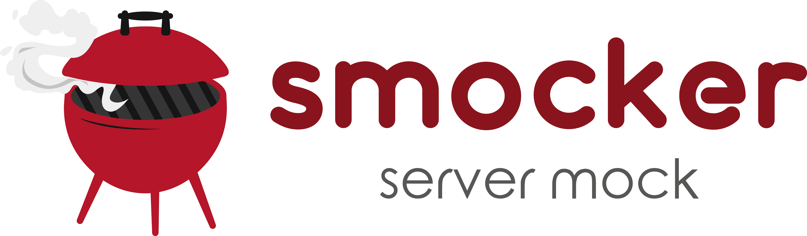
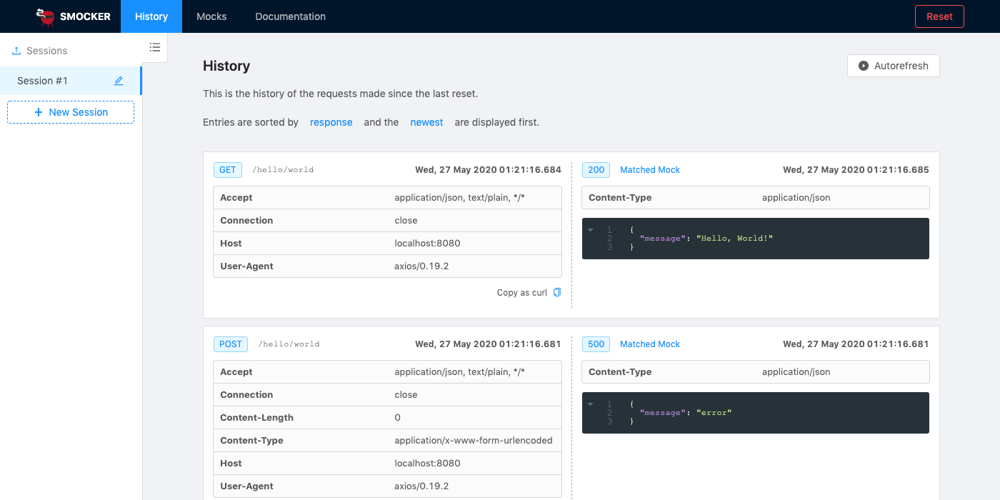
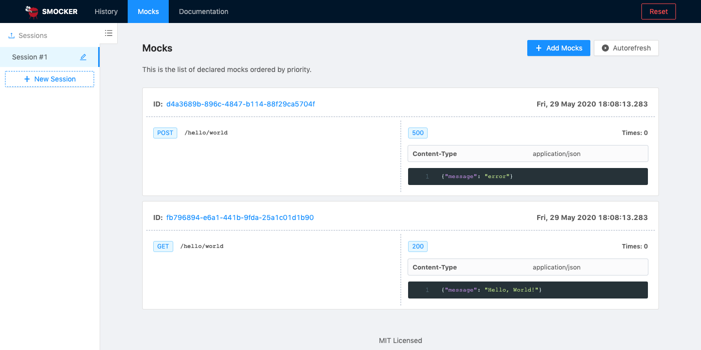

<h1 align="center">
  
</h1>

[](https://travis-ci.org/Thiht/smocker)
[](https://app.netlify.com/sites/smocker/deploys)
[](https://hub.docker.com/r/thiht/smocker)
[](https://github.com/Thiht/smocker/releases/latest)
[](https://goreportcard.com/report/github.com/Thiht/smocker)
[](https://github.com/Thiht/smocker/blob/master/LICENSE)

**Smocker** (server mock) is a simple and efficient HTTP mock server.

The documentation is available on [smocker.dev](https://smocker.dev).

## Table of contents

- [Installation](#installation)
  - [With Docker](#with-docker)
  - [Manual Deployment](#manual-deployment)
  - [Healthcheck](#healthcheck)
  - [User Interface](#user-interface)
- [Usage](#usage)
  - [Hello, World!](#hello-world)
- [Development](#development)
  - [Backend](#backend)
  - [Frontend](#frontend)
  - [Documentation](#documentation)
  - [Docker](#docker)
- [Authors](#authors)
- [Contributors](#contributors)

## Installation

### With Docker

```sh
docker run -d \
  --restart=always \
  -p 8080:8080 \
  -p 8081:8081 \
  --name smocker \
  thiht/smocker
```

### Manual Deployment

```sh
# This will be the deployment folder for the Smocker instance
mkdir -p /opt/smocker && cd /opt/smocker
wget -P /tmp https://github.com/Thiht/smocker/releases/latest/download/smocker.tar.gz
tar xf /tmp/smocker.tar.gz
nohup ./smocker -mock-server-listen-port=8080 -config-listen-port=8081 &
```

### Healthcheck

```sh
curl localhost:8081/version
```

### User Interface

Smocker exposes a configuration user interface. You can access it in your web browser on http://localhost:8081/.





## Usage

Smocker exposes two ports:

- `8080` is the mock server port. It will expose the routes you register through the configuration port
- `8081` is the configuration port. It's the port you will use to register new mocks. This port also exposes a user interface.

### Hello, World!

To register a mock, you can use the YAML and the JSON formats. A basic mock might look like this:

```yaml
# helloworld.yml
# This mock register two routes: GET /hello/world and GET /foo/bar
- request:
    # Note: the method could be omitted because GET is the default
    method: GET
    path: /hello/world
  response:
    # Note: the status could be omitted because 200 is the default
    status: 200
    headers:
      Content-Type: application/json
    body: >
      {
        "hello": "Hello, World!"
      }

- request:
    method: GET
    path: /foo/bar
  response:
    status: 204
```

You can then register it to the configuration server with the following command:

```sh
curl -XPOST \
  --header "Content-Type: application/x-yaml" \
  --data-binary "@helloworld.yml" \
  localhost:8081/mocks
```

After your mock is registered, you can query the mock server on the specified route, so that it returns the expected response to you:

```sh
$ curl -i localhost:8080/hello/world
HTTP/1.1 200 OK
Content-Type: application/json
Date: Thu, 05 Sep 2019 15:49:32 GMT
Content-Length: 31

{
  "hello": "Hello, World!"
}
```

To cleanup the mock server without restarting it, you can execute the following command:

```sh
curl -XPOST localhost:8081/reset
```

For more advanced usage, please read the [project's documentation](https://smocker.dev).

## Development

### Backend

The backend is written in Go. You can use the following commands to manage the development lifecycle:

- `make start`: start the backend in development mode, with live reload
- `make build`, `make VERSION=xxx build`: compile the code and generate a binary
- `make lint`: run static analysis on the code
- `make format`: automatically format the backend code
- `make test`: execute unit tests
- `make test-integration`: execute integration tests (require the backend to be started on the default ports)

### Frontend

The frontend is written with TypeScript and React. You can use the following commands to manage the development lifecycle:

- `yarn install`: install the dependencies
- `yarn start`: start the frontend in development mode, with live reload
- `yarn build`: generate the transpiled and minified files and assets
- `yarn lint`: run static analysis on the code
- `yarn format`: automatically format the frontend code
- `yarn test`: execute unit tests
- `yarn test:watch`: execute unit tests, with live reload

### Documentation

The documentation is written in Markdown using [Vuepress](https://vuepress.vuejs.org/). You can use the following commands to manage the documentation:

- `yarn install`: install the dependencies
- `yarn docs:generate`: regenerate documentation screenshots (require the whole application to be started on the default ports)
- `yarn docs:dev`: start the documentation in development mode, with live reload
- `yarn docs:build`: generate the static production documentation

### Docker

The application can be packaged as a standalone Docker image. You can use the following commands to manage the development lifecycle:

- `make build-docker`, `make VERSION=xxx build-docker`: build the application as a Docker image
- `make start-docker`, `make VERSION=xxx start-docker`: run a Smocker Docker image

## Authors

- [Thibaut Rousseau](https://github.com/Thiht)
- [Gwendal Leclerc](https://github.com/gwleclerc)

## Contributors

- [Amanda Yoshiizumi (mandyellow)](https://github.com/mandyellow): thank you for your awesome logo!
