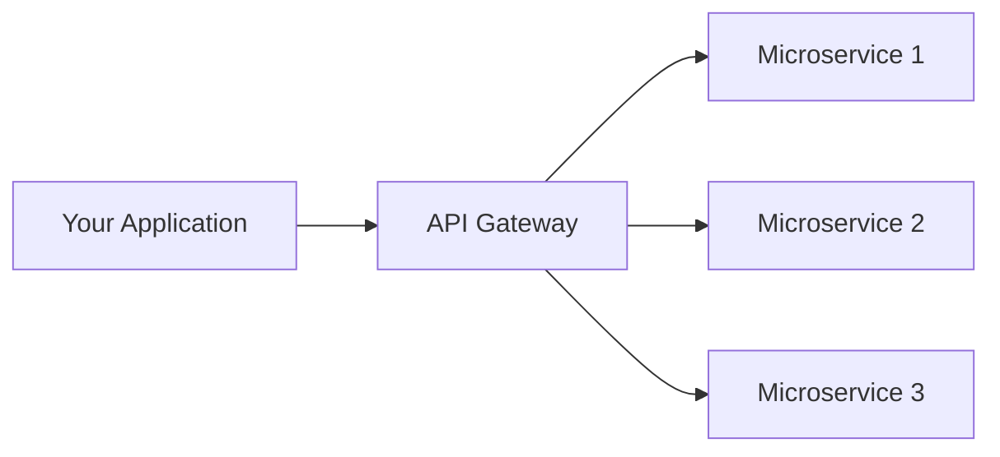
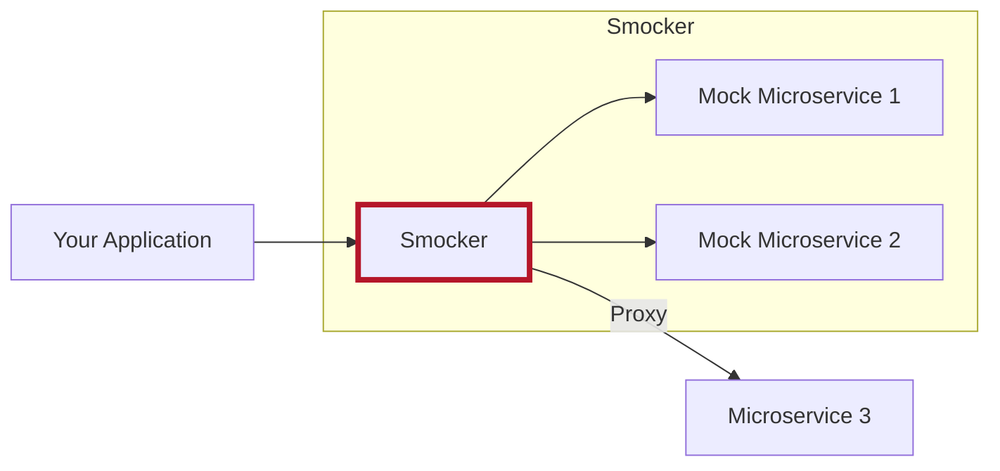

# What is Smocker?

**Smocker** (server mock) is a simple and efficient HTTP mock server.

The goal of Smocker is to help you **mock the HTTP dependencies of your application**. It's a great tool for **integration tests automation**.

Smocker really shines in a **microservice environment with an API gateway**. On your development or test infrastructure, you just need to deploy Smocker instead of your API gateway and have your application use it as the gateway.

**Production environment, with an API gateway**

**Test environment, with Smocker**

Smocker provides several powerful ways to setup your testing environment:

- **Static mocks** return a static response for a given request. It's the most basic behavior of Smocker,
- **Dynamic mocks** return a response with variable parts. Dynamic mocks can be declared using [Go templates](https://golang.org/pkg/html/template/) or [Lua](https://www.lua.org/),
- **Proxies** just forward the request to an actual server, because mocking is not always suitable for testing.

Smocker also has a great **user interface** which we use extensively to write tests iteratively.

