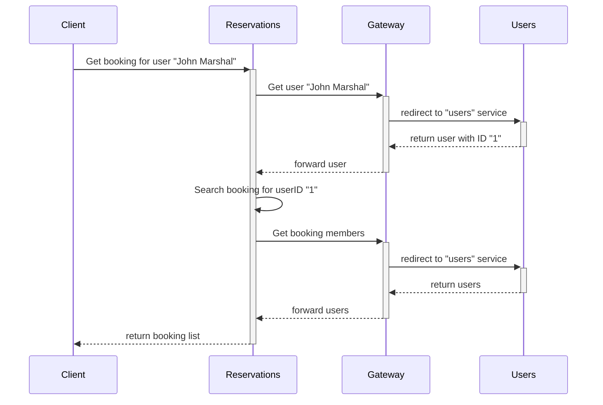
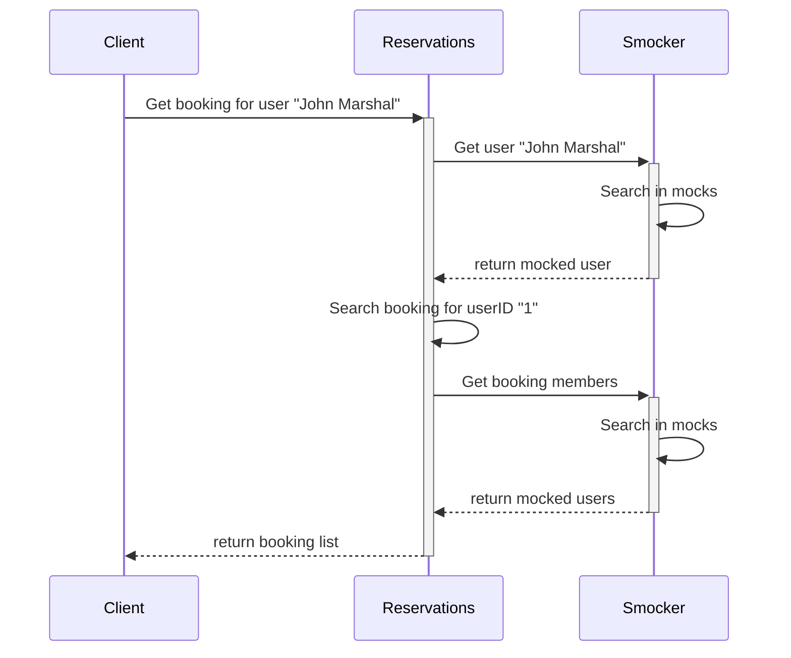

# Real Life Usage

::: warning Work in Progress
This page is not terminated yet.
:::

In real life scenarios, we not only use the **user interface of Smocker** but also its **API**. Smocker's API offers all the primitives to orchestrate your mocking environment in a fully automated way.

At [OVHCloud](https://www.ovhcloud.com/fr/), **we use Smocker in complement of [Venom](https://github.com/ovh/venom)**, an integration testing framework. Venom provides primitives to create HTTP calls, manipulate databases and message queues, and much more. It also provides a powerful context for writing assertions. This is completely optional though, simple shell scripts would work just fine, although they are less expressive and more complex to write.

## Real Life example using venom

### Introduction

Let's take a part of an hotel reservation system as an example.

We have:

- a `Users` service
- a `Reservations` service
- a `Gateway` to make them communicate together

And we want to test the following use case on `Reservations` service:

You can see that the `Gateway` is central in the communication between our two services
and we cannot test `Reservations` without making calls to `Users`.

Let's try to see a solution using smocker:

As you can see, if we use `Smocker` as `Gateway`,
we can completely remove the `Users` service without affecting the behavior of `Reservations`.

### Implementation

Most of API Gateways use HTTP Headers to know how to redirect calls between services.
So let's assumes that our gateway use the `X-SERVICE-NAME` header.