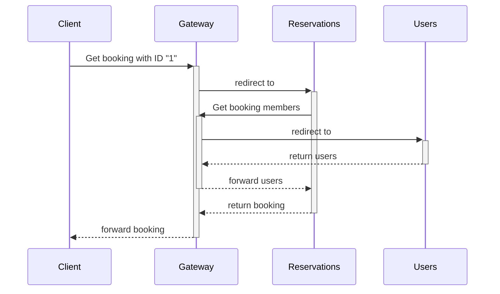

# Real Life Usage

In real life scenarios, we not only use the **user interface of Smocker** but also its **API**. Smocker's API offers all the primitives to orchestrate your mocking environment in a fully automated way.

At [OVHCloud](https://www.ovhcloud.com/fr/) for example, **Smocker is used in complement of [Venom](https://github.com/ovh/venom)**, an integration testing framework. Venom provides primitives to create HTTP calls, manipulate databases and message queues, and much more. It also provides a powerful context for writing assertions. This is completely optional though, simple shell scripts would work just fine, although they are less expressive and more complex to write.

## Introduction

Let's take a part of an hotel reservation system as an example.

We have:

- A `Users` service
- A `Reservations` service
- A `Gateway` to make them communicate together

And we want to test the following use case on `Reservations` service:

<div class="text-center figure fluid">



</div>

You can see that the `Gateway` is central in the communication between our two services
and we cannot test `Reservations` without making calls to `Users`.

Let's try to see a solution using smocker:

<div class="text-center figure fluid">


</div>

As you can see, if we use `Smocker` as `Gateway`,
we can completely remove the `Users` service without affecting the behavior of `Reservations`.

## Implementation

If we assume that our API Gateway uses a HTTP header to know how to redirect calls between services, we need to define some variables:

- Gateway Header: `X-SERVICE-NAME`
- Reservations Service Token: `reservations`
- Users Service Token: `users`

And then the services:

**Types**

```go
type User struct {
	ID   int64  `json:"id"`
	Name string `json:"name"`
}

type Reservation struct {
	ID          int64     `json:"id"`
	RoomNumber  int64     `json:"room_number"`
	Users       []int64    `json:"users"`
	EntryDate   time.Time `json:"entry_date"`
	ReleaseDate time.Time `json:"release_date"`
}
```

**APIs**

- Reservations

| Method |       URL        | Request Param Type |                                                     Response Example                                                     |
| :----: | :--------------: | :----------------: | :----------------------------------------------------------------------------------------------------------------------: |
|  GET   | /reservation/:id |       int64        | {"id":1,"room_number":1,"users":["user name"],"entry_date":"2020-01-01T18:00:00Z","release_date":"2020-01-02T12:00:00Z"} |

- Users

| Method |   URL   |   Request Body   |        Response Example        |
| :----: | :-----: | :--------------: | :----------------------------: |
|  POST  | /search | { "ids": [...] } | [{"id":1,"name":"User 1"},...] |

## Docker Compose File

Let's synthesize this in a docker-compose file:

```yml
version: "3"
services:
  smocker:
    image: thiht/smocker
    ports:
      - 8080:8080
      - 8081:8081

  db:
    image: postgres
    environment:
      - POSTGRES_DB: database
      - POSTGRES_USER: user
      - POSTGRES_PASSWORD: password
    ports:
      - 8082:5432

  reservations:
    image: reservations
    environment:
      POSTGRES_DSN: pgsql://user:password@(db:5432)/database
      GATEWAY_ADDR: http://smocker:8080
```

As you can see, we do not define the `users` service since we intend to mock it.

We also set **Smocker** as the gateway API on the `reservations` service using the **GATEWAY_ADDR** environment variable.
This could be done using configuration files or any other method.

The important thing is to make sure that your services calls go through **Smocker**.

## Test Files

Now that we can launch our services, let's set up the venom test.

### Directory

```
tests/
  fixtures/
    reservations.yml
  mocks.yml
  test.yml
```

### Database Fixture

Venom has a [dbfixture executor](https://github.com/ovh/venom/tree/master/executors/dbfixtures) which allows you to populate a database using yaml files.

- reservations.yml (**file name <=> table name** in database)

```yml
- id: 1
  room_number: 1
  users:
    - 1
    - 2
  entry_date: "2020-01-01T18:00:00Z"
  release_date: "2020-01-02T12:00:00Z"
```

For our purpose, we created a booking in the **reservations** table.

### Venom

#### Mocks

Let's go to the interesting part, the **mocks definition**.

- mocks.yml

```yml
- request:
    headers:
      X-SERVICE-NAME: reservations
  proxy:
    host: https://reservations:8080

- request:
    method: POST
    path: /search
    headers:
      X-SERVICE-NAME: users
    body:
      matcher: ShouldEqualJSON
      value: >
        { "ids": [1,2] }
  response:
    headers:
      Content-Type: application/json
    body: >
      [
        {
          "id": 1,
          "name": "User 1"
        },
        {
          "id": 2,
          "name": "User 2"
        }
      ]
```

As you can see in the file, we have defined two mocks:

- A **proxy mock** on all requests which have `reservations` as `X-SERVICE-NAME` header
- A **response mock** on `POST /search` requests which have `users` as `X-SERVICE-NAME` header \
  (in our case, the body's matcher is redundant and could be removed as we will only make one call)

#### Tests

And finally, the venom test.

- test.yml

```yml
name: Retrieve Reservation

vars:
  gw: http://localhost:8080
  mockserver: http://localhost:8081
  dsn: user:password@(localhost:8082)/database

testcases:
  - name: Get reservation with ID "1"
    steps:
      # Init
      - type: dbfixtures
        database: postgres
        dsn: "{{.dsn}}"
        files:
          - fixtures/reservations.yml
      - type: http
        method: POST
        url: http://{{.mockserver}}/sessions?name=test1
        assertions:
          - result.statuscode ShouldEqual 200
      - type: http
        method: POST
        url: http://{{.mockserver}}/mocks
        body: ./mocks.yml
        assertions:
          - result.statuscode ShouldEqual 200

      # Get Reservation
      - type: http
        method: GET
        url: http://{{.gw}}/reservation/1
        headers:
          X-SERVICE-NAME: reservations
        assertions:
          - result.statuscode ShouldEqual 200
          - result.bodyjson.id ShouldEqual 1
          - result.bodyjson.room_number ShouldEqual 1
          - result.bodyjson.users.users0 ShouldEqual "User 1"
          - result.bodyjson.users.users1 ShouldEqual "User 2"
          - result.bodyjson.entry_date ShouldEqual "2020-01-01T18:00:00Z"
          - result.bodyjson.release_date ShouldEqual "2020-01-02T12:00:00Z"
```

To simply describe the above test, venom will

- Init the dabase using the `reservations.yml` fixture file
- Create a smocker session named `test1` (optional, because Smocker automatically create a session on the first call)
- Set the mocks into Smocker using the `mocks.yml` file
- Call the reservation API through the gateway API (a.k.a **Smocker**) and make assertions on result. \
  We chose to make the initial call through Smocker in order to
  - Show an example of a **proxy mock**
  - Display the venom call in Smocker history. \
    If we had made the call directly on `reservations` service, we would only have the call to `users` service on Smocker's history.

For real venom tests examples, we invite you to check the [Smocker's venom tests](https://github.com/Thiht/smocker/tree/master/tests/features).
