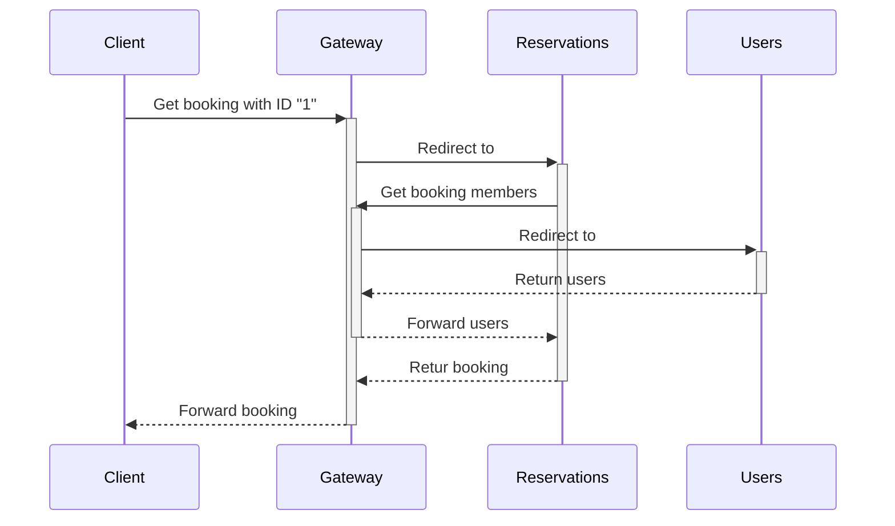
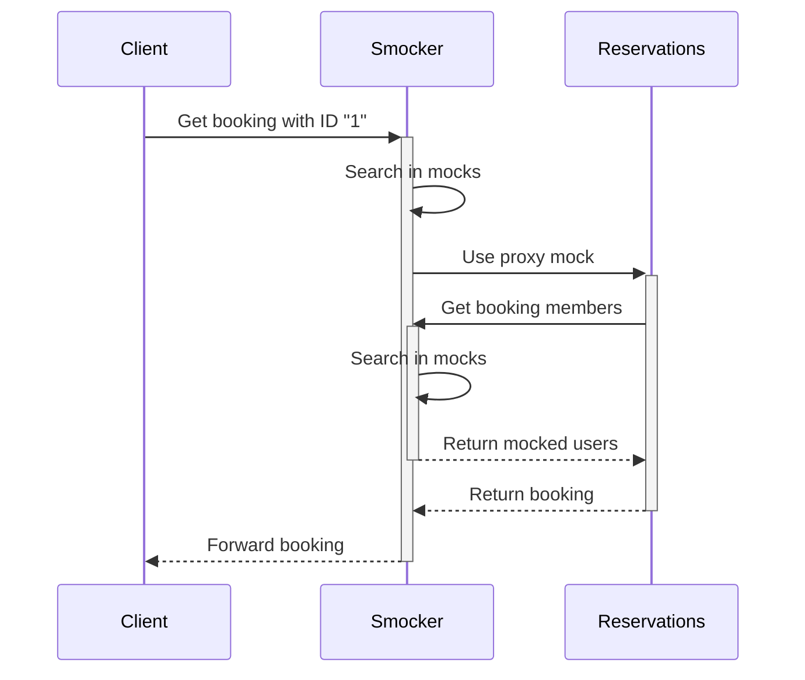

# Real Life Usage

In real life scenarios, we not only use the **user interface of Smocker** but also its **API**. Smocker's API offers all the primitives to orchestrate your mocking environment in a fully automated way.

At [OVHCloud](https://www.ovhcloud.com/fr/) for example, **Smocker is used in complement of [Venom](https://github.com/ovh/venom)**, an integration testing framework. Venom provides primitives to create HTTP calls, manipulate databases and message queues, and much more. It also provides a powerful context for writing assertions. This is completely optional though, simple shell scripts would work just fine, although they are less expressive and more complex to write.

## Introduction

In this example, we will consider an hotel reservation system.

The system infrastructure is composed of:

- a **Reservations** microservice, managing the reservations,
- a **Users** microservice, managing the customers of the hotel,
- a **Gateway** to make them communicate together.

We will test the following use case on the **Reservations** microservice:

<div class="text-center figure fluid">



</div>

In this use case, the client makes a call through the gateway to the **Reservations** service to retrieve the booking with ID "1".
The **Reservations** service makes a call through the gateway to the **Users** service to retrieve the data of the users associated to the booking.

The **Gateway** is central in the communication between our two services and we cannot test **Reservations** without indirectly making a call to **Users**.
Since the service we want to test is **Reservations**, we want a solution to mock the calls to the **Users** service. That's what **Smocker** will allow us to do.

Now let's see what we can do if we replace the **Gateway** by a **Smocker** instance:

<div class="text-center figure fluid">



</div>

As you can see, by using **Smocker** instead of the **Gateway**,
we can completely remove the **Users** service without affecting the behavior of **Reservations**.

## Implementation

If we assume that our API Gateway uses an HTTP header to know how to redirect calls between services, we need to define some variables:

- Gateway Header: `X-Service-Name` \
  This is the header that will be used by the gateway to know where to forward the calls it receives.
  For instance, if the gateway receives a call with the header `X-Service-Name: reservations`, it will know the calls needs to be forwarded to the `reservations` service.
- Reservations Service Token: `reservations` \
  This is the token of our **Reservations** service. It's a value that can be used with the `X-Service-Name` header.
- Users Service Token: `users` \
  This is the token of our **Users** service. It's a value that can be used with the `X-Service-Name` header.

The services APIs and types are defined below.

### Reservations Service

#### Type

```go
type Reservation struct {
	ID          int64     `json:"id"`
	RoomNumber  int64     `json:"room_number"`
	Users       []int64   `json:"users"`
	EntryDate   time.Time `json:"entry_date"`
	ReleaseDate time.Time `json:"release_date"`
}
```

#### API

<table>
<thead>
<tr>
<th>Method</th>
<th>URL</th>
<th>Request Parameter Type</th>
<th>Response Example</th>
</tr>
</thead>
<tbody>
<tr>
<td>GET</td>
<td>

`/reservation/:id`

</td>
<td>int64</td>
<td>

```json
{
  "id": 1,
  "room_number": 1,
  "users": [1, 2, 3],
  "entry_date": "2020-01-01T18:00:00Z",
  "release_date": "2020-01-02T12:00:00Z"
}
```
</td>
</tbody>
</table>

### Users Service

#### Type

```go
type User struct {
	ID   int64  `json:"id"`
	Name string `json:"name"`
}
```

#### API

<table>
<thead>
<tr>
<th>Method</th>
<th>URL</th>
<th>Request Body</th>
<th>Response Example</th>
</tr>
</thead>
<tbody>
<tr>
<td>POST</td>
<td>

`/search`

</td>
<td>

```json
{ "ids": [...] }
```

</td>
<td>

```json
[
  { "id": 1, "name": "User 1" }
  //...
]
```

</td>
</tr>
</tbody>
</table>

## Docker Compose File

Let's synthesize this in a docker-compose file:

```yml
version: "3"
services:
  smocker:
    image: thiht/smocker
    ports:
      - 8080:8080
      - 8081:8081

  db:
    image: postgres
    environment:
      - POSTGRES_DB: database
      - POSTGRES_USER: user
      - POSTGRES_PASSWORD: password
    ports:
      - 8082:5432

  reservations:
    image: reservations
    environment:
      POSTGRES_DSN: pgsql://user:password@(db:5432)/database
      GATEWAY_ADDR: http://smocker:8080
```

As you can see, we do not define the `users` service since we intend to mock it.

We also set **Smocker** as the gateway API on the `reservations` service using the `GATEWAY_ADDR` environment variable.
This could be done using configuration files or any other method.

The important thing is to make sure that your services calls go through **Smocker**.

## Test Files

Now that we can launch our services, let's set up the Venom test.

### Directory Structure

```
tests/
  fixtures/
    reservations.yml
  mocks.yml
  test.yml
```

### Database Fixture

Venom has a [dbfixtures executor](https://github.com/ovh/venom/tree/master/executors/dbfixtures) which allows you to populate a database using YAML files.

- `reservations.yml` (the filename will determine the table name in the database, so a "reservations" table will be created)

```yml
- id: 1
  room_number: 1
  users:
    - 1
    - 2
  entry_date: "2020-01-01T18:00:00Z"
  release_date: "2020-01-02T12:00:00Z"
```

For our purpose, we created a booking in the **reservations** table.

### Venom

#### Mocks

Let's go to the interesting part, the **mocks definition**.

- `mocks.yml`

```yml
- request:
    headers:
      X-Service-Name: reservations
  proxy:
    host: https://reservations:8080

- request:
    method: POST
    path: /search
    headers:
      X-Service-Name: users
    body:
      matcher: ShouldEqualJSON
      value: >
        { "ids": [1,2] }
  response:
    headers:
      Content-Type: application/json
    body: >
      [
        {
          "id": 1,
          "name": "User 1"
        },
        {
          "id": 2,
          "name": "User 2"
        }
      ]
```

As you can see in the file, we have defined two mocks:

- A **proxy mock** on all requests which have `reservations` as `X-Service-Name` header,
- A **response mock** on `POST /search` requests which have `users` as `X-Service-Name` header \
  (in our case, the body's matcher is redundant and could be removed as we will only make one call).

#### Tests

And finally, the Venom test.

- `test.yml`

```yml
name: Retrieve Reservation

vars:
  gw: http://localhost:8080
  mockserver: http://localhost:8081
  dsn: user:password@(localhost:8082)/database

testcases:
  - name: Get reservation with ID "1"
    steps:
      # Init
      - type: dbfixtures
        database: postgres
        dsn: "{{.dsn}}"
        files:
          - fixtures/reservations.yml

      - type: http
        method: POST
        url: http://{{.mockserver}}/sessions?name=test1
        assertions:
          - result.statuscode ShouldEqual 200

      - type: http
        method: POST
        url: http://{{.mockserver}}/mocks
        body: ./mocks.yml
        assertions:
          - result.statuscode ShouldEqual 200

      # Get Reservation
      - type: http
        method: GET
        url: http://{{.gw}}/reservation/1
        headers:
          X-Service-Name: reservations
        assertions:
          - result.statuscode ShouldEqual 200
          - result.bodyjson.id ShouldEqual 1
          - result.bodyjson.room_number ShouldEqual 1
          - result.bodyjson.users.users0 ShouldEqual "User 1"
          - result.bodyjson.users.users1 ShouldEqual "User 2"
          - result.bodyjson.entry_date ShouldEqual "2020-01-01T18:00:00Z"
          - result.bodyjson.release_date ShouldEqual "2020-01-02T12:00:00Z"
```

To simply describe the above test, Venom will:

- Initialize the database using the `reservations.yml` fixture file,
- Create a Smocker session named `test1` (optional, because Smocker automatically creates a session on the first call),
- Set the mocks into Smocker using the `mocks.yml` file,
- Call the reservation API through the gateway API (**Smocker** in this case), and make assertions on the result. \
  We chose to make the initial call through Smocker in order to:
  - Show an example of a **proxy mock**,
  - Display the Venom call in Smocker's history. \
    If we had made the call directly on the `reservations` service, we would only have the call to the `users` service on Smocker's history.

For real Venom tests examples, we invite you to check the [Smocker's test suite](https://github.com/Thiht/smocker/tree/master/tests/features).
